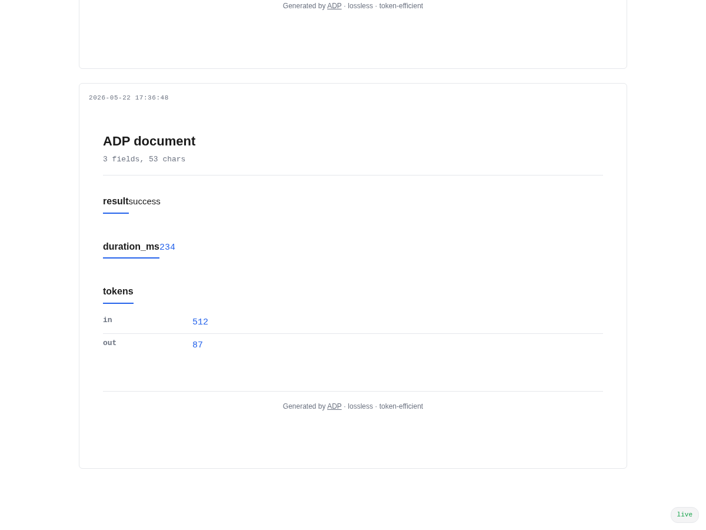

# ADP — Adriano Dal Pastro format


> 🇮🇹 Per la versione italiana: [README.it.md](README.it.md)

**A lossless, aggressively token-efficient text format for communication between AI agents.**

ADP (version 0.2) is a Python library that defines and implements a small
serialization language designed specifically for message exchange between
language models. It is not intended to be read by a human at a glance: that
is the job of the converters to readable Markdown and canonical JSON.

The goal is to reduce the number of tokens that agents spend communicating
with each other, while preserving all structural information from a typical
JSON payload — nested maps, lists, tables with nested cells, multiline text,
typed primitives, **bytes** — without ever introducing data loss.

**How much it saves (vs JSON-min, cl100k_base tokenizer):**

| Typical payload | JSON-min (tok) | ADP (tok) | Δ |
|---|---:|---:|---:|
| Homogeneous table (it) | 333 | 164 | **+50.8%** |
| Contact list with URL/email | 145 | 94 | **+35.2%** |
| Tables with nested cells | 100 | 75 | **+25.0%** |
| 20-message agent-to-agent conversation (full stack) | 2079 | **908** | **+56.3%** |

The last row is achieved with `ADPSession` (dynamic LUT HPACK-style + differential inter-message encoding + capability negotiation + TPD auto-promotion + tokenizer-aware cost). On the same payload, **TOON** requires 2249 tokens: ADP is **2.5× cheaper than TOON** in realistic multi-turn scenarios. See the [Dynamic LUT](#dynamic-lut-hpack-style--differential-encoding) section for details.

## Table of Contents

1. [Why ADP](#why-adp)
2. [Installation](#installation)
3. [Quickstart](#quickstart)
4. [Syntax cheat sheet](#syntax-cheat-sheet)
5. [Converters](#converters)
6. [AI agent integration](#ai-agent-integration)
7. [Dynamic LUT (HPACK-style) + differential encoding](#dynamic-lut-hpack-style--differential-encoding)
8. [Measured token reduction](#measured-token-reduction)
9. [Side-by-side examples](#side-by-side-examples)
10. [Images](#images)
11. [Using ADP in Claude Code](#using-adp-in-claude-code)
12. [Integrity — sign / verify](#integrity--sign--verify)
13. [Project structure](#project-structure)
14. [Development and testing](#development-and-testing)
15. [Roadmap](#roadmap)
16. [License](#license)

---

## Why ADP

When two or more AI agents exchange data, the most natural representation is
JSON. JSON works very well for machines, but it is verbose for LLM tokenizers:
every quotation mark around a key costs tokens, every `true` costs more than
a single `1`, every table of homogeneous rows pays the price of repeating keys
on every row, and binary bytes cannot be represented natively.

ADP makes the design decisions that JSON could not afford:

- no mandatory quotes around keys or simple strings;
- `1`/`0` in place of `true`/`false`, `~` in place of `null`;
- literal newlines inside strings (no `\n` escape sequences);
- a dedicated table notation for lists of homogeneous dictionaries,
  which supports **nested cells** (lists and maps);
- extended bare strings to absorb URLs, emails, and paths without quotes;
- native `bytes` via the `b!` prefix + standard base64;
- top-level without wrappers (`name=value;name=value` instead of redundant syntax).

The trade-off is the loss of direct human readability, but the library's
Markdown converter always reconstructs a readable version, while the JSON
converter restores a universally machine-readable structure.

## Installation

```bash
uv sync --all-extras
```

Requirements: Python 3.11 or higher.

## Quickstart

```python
import adp

payload = {
    "user": {"id": 42, "name": "Adriano", "active": True, "email": "adp@example.com"},
    "users": [                                              # tabella inferita
        {"id": 1, "name": "alice", "roles": ["admin", "ops"]},
        {"id": 2, "name": "bob",   "roles": ["dev"]},
    ],
    "thumbnail": b"\x89PNG\r\n\x1a\n...",                   # bytes nativi
    "report": "Riga 1\nRiga 2 con \"virgolette\"",          # multilinea letterale
}

s = adp.encode(payload)
print(s)
# user={id=42;name=Adriano;active=1;email=adp@example.com};
# users=#id,name,roles|1i,alice,[admin,ops]|2,bob,[dev];
# thumbnail=b!iVBORw0KGgoaLi4u;
# report="Riga 1
# Riga 2 con \"virgolette\""

assert adp.decode(s) == payload   # round-trip lossless, bytes inclusi

print(adp.to_json(s))      # JSON canonico per macchine non-AI
print(adp.to_markdown(s))  # Markdown leggibile per umani
```

From the command line:

```bash
echo '{"user":{"id":42,"name":"Adriano"}}' | uv run adp encode
# user={id=42;name=Adriano}

echo 'user={id=42;name=Adriano}' | uv run adp decode
# {"user": {"id": 42, "name": "Adriano"}}

uv run adp bench < payload.json    # confronto token ADP vs JSON
uv run adp prompt --few-shot       # stampa il prompt di sistema per LLM
```

## Syntax cheat sheet

| Element | Syntax | Example |
|---|---|---|
| Top-level | `name=value;name=value` | `id=42;ok=1` |
| Integer | bare | `42`, `-7` |
| Integer 0 or 1 (disambiguation) | suffix `i` | `0i`, `1i` |
| Float | with decimal point | `3.14`, `-0.5` |
| Boolean | `1` / `0` | `1` = true |
| Null | `~` | `~` |
| Bytes | `b!<base64>` | `b!aGVsbG8=` |
| Bare string | without quotes | `Adriano`, `ops@acme.example`, `https://x.y/api` |
| Quoted string | within `"..."` | `"with space"` |
| Escape inside string | only `\"` and `\\` | `"says \"hello\""` |
| List | `[a,b,c]` | `[admin,root]` |
| Map | `{k=v;k=v}` | `{id=1;qty=2}` |
| Table | `#h1,h2\|r1c1,r1c2\|...` | `#id,unit\|1i,kg\|2,m` |
| Table with nested cells | `#h\|[a,b]\|{k=v}` | `#id,tags\|1i,[a,b]\|2,[c]` |

A string needs quotes only if it contains spaces, newlines, syntactic
delimiters (`,;=[]{}|"#&~`), or if it looks like a number. Everything else
can be "bare" — including emails (`@`), URLs (`:`, `/`), paths (`/`, `.`),
expressions with parentheses (`(2+3)`).

Full grammar: see
[`docs/superpowers/specs/2026-05-22-adp-design.md`](docs/superpowers/specs/2026-05-22-adp-design.md).

## Converters

| Direction | Function | Round-trip | Typical use |
|---|---|:---:|---|
| Python → ADP | `adp.encode(obj)` | ✓ | serialization |
| ADP → Python | `adp.decode(s)` | ✓ | deserialization |
| ADP → JSON | `adp.to_json(s)` | ✓ | non-AI machines |
| JSON → ADP | `adp.from_json(s)` | ✓ | import from JSON |
| ADP → Markdown | `adp.to_markdown(s)` | ✗ (one-way) | human reading |
| ADP → HTML | `adp.to_html(s)` | ✗ (one-way) | dashboards, browser |

### Standalone HTML with automatic dark mode

```python
html_page = adp.to_html(adp_msg, title="Report Q1")
Path("report.html").write_text(html_page)
```

Produces a complete HTML5 document with embedded CSS, bordered tables,
automatic light/dark switching via `prefers-color-scheme`, tooltips on bytes,
and code blocks for multiline text. From the CLI: `adp to-html < msg.adp > out.html`.

### Dynamic HTML page (live append-only viewer)

For scenarios where an agent emits ADP records as a continuous stream (logs,
monitoring, multi-step output), the `adp serve` subcommand starts a small HTTP
server that opens a **single page** auto-updated via Server-Sent Events: each
new record is rendered and appended at the bottom without reloading the page.

```bash
my-agent-emitting-adp | uv run adp serve --port 8000
# Apri http://localhost:8000 nel browser; la pagina si aggiorna in tempo reale
```



Features:

- zero dependencies (uses only stdlib `http.server`)
- chronological page with a timestamp for each record
- automatic backfill of records already received if the browser is opened late
- live/disconnected indicator in the bottom right corner
- record counter in the header
- maintains auto-scroll to the bottom as new data arrives

Typical use cases: long-running agent monitoring, multi-step pipeline debugging,
development dashboards, client demos.

Bytes in the JSON pass-through are encoded as
`{"_adp_bytes": "<base64>"}` to preserve them.

## AI agent integration

### 1. System prompt

```python
import adp
from anthropic import Anthropic

client = Anthropic()
resp = client.messages.create(
    model="claude-opus-4-7",
    system=adp.system_prompt(),
    messages=[{"role": "user", "content": "Restituisci un report con id 42 e due metriche."}],
    max_tokens=1024,
)
data = adp.decode(resp.content[0].text)
```

The `adp.prompt` module exposes `system_prompt()`, `few_shot_examples()`,
`few_shot_block()`.

### 2. Validator-with-retry

```python
def chat_in_adp(prompt: str, max_retries: int = 2) -> dict:
    history = [{"role": "user", "content": prompt}]
    for _ in range(max_retries + 1):
        out = llm_call(system=adp.system_prompt(), messages=history)
        try:
            return adp.decode(out)
        except adp.ADPParseError as e:
            history.append({"role": "assistant", "content": out})
            history.append({"role": "user", "content": f"Errore: {e}. Riemetti SOLO ADP valido."})
    raise RuntimeError("ADP non valido dopo retry")
```

### 3. Multi-agent pipeline

```python
def pipeline(input_data: dict) -> dict:
    msg = adp.encode(input_data)
    msg = agent_call("planner",  system=adp.system_prompt(), user=msg); adp.decode(msg)
    msg = agent_call("executor", system=adp.system_prompt(), user=msg); adp.decode(msg)
    msg = agent_call("reviewer", system=adp.system_prompt(), user=msg)
    return adp.decode(msg)
```

### 4. Session persistence

```python
Path("session.adp").write_text(msg, encoding="utf-8")
restored = adp.decode(Path("session.adp").read_text(encoding="utf-8"))
```

## LUT — Shared Look-Up Table (optional, additional savings)

If sender and receiver share a **LUT** (abbreviation table), recurring keys
are compressed to 1–2 characters during encoding and restored during decoding.
The final message is no longer textually readable but remains lossless and
passes through the same parser.

```python
import adp

LUT = {"user": "u", "id": "i", "name": "n", "email": "em"}
obj = {"user": {"id": 42, "name": "Adriano", "email": "a@b.c"}}

s = adp.encode(obj, key_lut=LUT)
# 'u={i=42;n=Adriano;em=a@b.c}'        (vs 'user={id=42;name=Adriano;email=a@b.c}')

assert adp.decode(s, key_lut=LUT) == obj
```

The library exposes `adp.DEFAULT_AGENT_LUT`, a pre-packaged LUT for typical
inter-agent message field names (`msg_id`, `from_agent`, `intent`, `payload`,
`id`, `name`, `status`, `value`, ...). On an inter-agent task message, savings
grow from +5.7% (ADP alone) to **+13.6%** (ADP+LUT) on cl100k_base tokens.

LUT constraints: keys and abbreviations must be valid identifiers
`[A-Za-z_][A-Za-z0-9_-]*`; abbreviations cannot coincide with reserved literals
(`~`, `0`, `1`, `0i`, `1i`). `adp.validate_lut(lut)` checks both requirements.

## Dynamic LUT (HPACK-style) + differential encoding

The static LUT requires that sender and receiver share the same abbreviation
dictionary in advance. For scenarios where agents cannot coordinate beforehand,
or where the vocabulary is specific to the conversation domain, ADP provides
`ADPSession`: an **adaptive HPACK-style dynamic LUT** (modeled on HTTP/2 header
compression, RFC 7541) that **grows synchronously during the session** via
in-band updates, and a **differential inter-message encoding** that sends only
the delta relative to the previous message when it is advantageous to do so.

The two techniques are orthogonal and composable: on the same 20-message
agent-to-agent workload, the combination `static LUT + dynamic LUT + diff
encoding` (full stack) reduces tokens by **56.9% relative to JSON-min** and
**60.1% relative to TOON** (best competitor).

### Basic usage

```python
import adp

session = adp.ADPSession()   # carica/crea ~/.adp/lut_state.json

# Mittente A
msg = session.encode({
    "user": {"id": 42, "role": "administrator", "dept": "engineering"},
    "user2": {"id": 43, "role": "administrator", "dept": "engineering"},
})
# msg contiene un prefisso _lut_add={...} con le nuove sigle dinamiche,
# poi il payload sostituito con quelle sigle.

# Destinatario B (con la propria ADPSession)
obj = session.decode(msg)
# Lo stato LUT di entrambi è ora sincronizzato dopo la decodifica.
```

The state grows with every exchanged message. Automatic local persistence in
`~/.adp/lut_state.json` (override via the `path=` parameter or the
`ADP_LUT_PATH` env variable). LRU bounded to 256 entries by default. Pure
stdlib, zero new dependencies.

### In-band syntax

ADPSession emits three reserved top-level prefixes at the start of each message:

| Prefix | Meaning |
|---|---|
| `_lut_add={alias=fullname;...}` | adds new entries to the dynamic LUT |
| `_lut_reset=1` | completely clears the receiver's dynamic LUT |
| `_base=ID;_diff={set=...;del=[...]}` | applies a diff to the baseline ID |

Dynamic aliases use the reserved namespace `_N` (underscore + digits),
disjoint from the short letters of the static LUT. Deterministic side-local LRU
eviction: sender and receiver evict identically because they observe the same
insertions and the same accesses.

### Differential encoding

When two consecutive messages in the same direction share most of their fields
(a typical pattern: status reports, incremental results, state updates),
`ADPSession` computes the diff and sends only the changes:

```python
sender = adp.ADPSession()
receiver = adp.ADPSession()

msg1 = sender.encode({"task_id": "t1", "user": {"id": 42, "role": "administrator"}})
receiver.decode(msg1)

# Secondo messaggio: cambia solo task_id, user resta uguale
msg2 = sender.encode({"task_id": "t2", "user": {"id": 42, "role": "administrator"}})
# msg2 ≈ "_base=a3f2;_diff={set={task_id=t2}};"
# molto più corto del payload completo
receiver.decode(msg2)
```

The encoder automatically evaluates when to emit a diff: only if the encoded
diff is smaller than `diff_threshold * len(full_msg)` (default 0.7). For
massive changes, it automatically falls back to full encoding. Recovery after
desynchronization via `session.encode_full(obj)`.

### Synchronization and recovery

Sender and receiver maintain independent states that align by construction:
every message carries the LUT updates needed for its own decoding and (for
diffs) a base_id that uniquely identifies the previous payload. If the receiver
does not recognize the base_id (because it lost its state, just restarted, or
received messages out of order), it raises `ADPDiffSyncError`. The application
catches the error and requests a full re-send from the sender via `encode_full()`.

```python
try:
    obj = receiver.decode(msg)
except adp.ADPDiffSyncError:
    # Recovery: chiedi al mittente un full re-send
    request_full_resend()
except adp.ADPLUTSyncError:
    # Alias dinamico sconosciuto: stessa logica di recovery
    request_full_resend()
```

### Static vs dynamic vs full stack comparison

Benchmark on 20 agent-to-agent messages (planner ↔ executor) with the
`cl100k_base` tokenizer. Realistic request/reply pattern, structured payload
(nested dict + list of events):

| Format | Total tokens | Δ vs JSON | Δ vs TOON |
|---|---:|---:|---:|
| JSON-min | 2079 | baseline | +7.6% |
| **TOON** | **2249** | **−8.2%** | baseline |
| ADP base (no LUT) | 1903 | +8.5% | +15.4% |
| ADP + static LUT (`DEFAULT_AGENT_LUT`) | 1833 | +11.8% | +18.5% |
| ADP + dynamic LUT (cold) | 2071 | +0.4% | +7.9% |
| ADP + dynamic + static LUT | 1890 | +9.1% | +16.0% |
| ADP + dynamic LUT + diff encoding | 977 | +53.0% | +56.6% |
| ADP + full stack (static + dynamic + diff) | 931 | +55.2% | +58.6% |
| **ADP full stack + tokenizer-aware cost** | **908** | **+56.3%** | **+59.6%** |

With warm-start (pre-populating the LUT from a past session log via
`session.warmup(messages_log)`), the second half of a conversation saves an
additional ~6% compared to cold-start.

### Comprehensive benchmark: 7 workloads × 4 lengths

Beyond the single benchmark above, a broader suite covers seven different
workloads (status polling, tool use, narrative, ETL pipeline, broadcast,
DB query, mixed) at four conversation lengths (10/50/100/500 messages), with
estimated cost in $ per provider and encode/decode latency.

Summary @ 100 messages per workload — ADP full stack vs TOON (best competitor):

| Workload | Δ vs TOON | Savings $ per 1k msg (Sonnet 4.6) |
|---|---:|---:|
| status_polling | **+61.1%** | $0.156 |
| etl_pipeline | **+60.2%** | $2.61 |
| mixed | **+49.8%** | $0.418 |
| db_query_response | **+18.8%** | $0.114 |
| tool_use | **+15.3%** | $0.019 |
| multi_agent_broadcast | **+11.3%** | $0.015 |
| long_narrative | +1.3% | $0.003 |

The gain is highest on workloads with high inter-message similarity (status
polling) or strong tabular structure (ETL pipeline). On free-prose text
(long_narrative) the margin is minimal because diff/dynamic LUT have little
recurring material to capture.

Full report with all lengths, latency, pricing per provider:
[`benchmarks/comprehensive_report.md`](benchmarks/comprehensive_report.md).
Regenerate with:

```bash
uv run --with toon-py --with tiktoken python -m benchmarks.bench_comprehensive
```

The main gain comes from diff encoding: on request/reply patterns with similar
payloads between consecutive messages, the delta is a tiny fraction of the full
payload. The dynamic LUT cold-start alone is not particularly competitive
because the static LUT already covers most frequent patterns — the real added
value is the combination with diff and dynamic specialization on the session
vocabulary.

To regenerate the benchmark:

```bash
uv run --with toon-py --with tiktoken python -m benchmarks.bench_dynamic_lut
```

### When to use what

| Scenario | Recommended configuration |
|---|---|
| Single message, uncoordinated agents | ADP base |
| Agents sharing a codebase (pre-shared LUT) | ADP + static LUT (`DEFAULT_AGENT_LUT`) |
| Long session, domain-specific vocabulary | ADP + dynamic LUT |
| Request/reply pattern, similar payloads between messages | ADP + diff encoding |
| **Mixed workload, maximum savings** | **ADPSession full stack** |

### Main parameters

```python
session = adp.ADPSession(
    # Core
    path="~/.adp/lut_state.json",  # None = in-memory; env ADP_LUT_PATH override
    max_entries=256,               # bound LRU
    static_lut=adp.DEFAULT_AGENT_LUT,
    k_threshold=2,                 # quante occorrenze in msg per aggiungere entry
    auto_save=True,                # persistenza atexit
    # Diff encoding
    enable_diff=True,              # disabilita per messaggi stateless
    diff_threshold=0.7,            # diff usato solo se len < 0.7 * full
    # Tokenizer-aware cost (opzionale, richiede tiktoken)
    cost_estimator=adp.TokenizerCostEstimator("cl100k_base"),
    # Capability negotiation
    announce_caps=True,            # annuncia _caps={...} al primo msg
    caps_timeout_msgs=3,           # auto-degrade dopo N send senza peer_caps
    # TPD auto-promotion (Phrase learning durante sessione)
    tpd_promote_every=10,          # 0 = disabilitato
    tpd_promote_max_per_run=10,    # cap entry promosse per giro
)

# Pre-warm da corpus passato (accelera bootstrap)
session.warmup(past_messages_log)

# Recovery dopo sync error
try:
    obj = session.decode(received)
except (adp.ADPLUTSyncError, adp.ADPDiffSyncError):
    msg = session.encode_full(payload)  # forza re-send completo
```

Full API: `encode`, `encode_full`, `encode_reset`, `decode`, `reset`,
`reset_caps`, `save`, `stats`, `warmup`, `_run_tpd_promotion`,
property `peer_caps`. Stateless helpers: `apply_lut_updates`,
`encode_with_dyn_lut`. Standalone estimator: `TokenizerCostEstimator`,
`estimate_cost`.

See the `src/adp/session.py` module and the design spec at
[`docs/superpowers/specs/2026-05-24-dynamic-lut-design.md`](docs/superpowers/specs/2026-05-24-dynamic-lut-design.md).

Optional extra for precise cost-benefit analysis:
```bash
pip install adp[tokenizer]   # adds tiktoken
```

## Measured token reduction

`cl100k_base` tokenizer (Claude 3.x / GPT-4), comparison vs JSON-min:

| Payload | JSON-min (tok) | ADP (tok) | Δ cl100k | Δ o200k |
|---|---:|---:|---:|---:|
| short_string_en | 15 | 13 | **+13.3%** | +13.3% |
| short_string_it | 18 | 16 | **+11.1%** | +11.8% |
| long_text_en | 115 | 109 | +5.2% | +5.3% |
| long_text_it | 176 | 170 | +3.4% | +3.7% |
| special_chars_en | 92 | 89 | +3.3% | +3.4% |
| special_chars_it | 134 | 131 | +2.2% | +2.4% |
| **tabular_en** | **241** | **145** | **+39.8%** | +40.1% |
| **tabular_it** | **333** | **164** | **+50.8%** | +46.4% |
| database_en | 150 | 134 | +10.7% | +10.5% |
| database_it | 180 | 157 | +12.8% | +12.8% |
| agent_task_en | 88 | 83 | +5.7% | +6.8% |
| agent_task_it | 118 | 113 | +4.2% | +5.0% |
| **contacts_en** (URL/email) | **145** | **94** | **+35.2%** | +34.9% |
| **nested_table_en** (nested cells) | **100** | **75** | **+25.0%** | +30.3% |
| binary_en | (JSON N/A) | 279 | — | — |

With `DEFAULT_AGENT_LUT` on `agent_task_en`, savings rise from +5.7% to **+13.6%**.

Reading guide: ADP wins significantly where the structure is a homogeneous
table or contains many URLs/emails (extended bare strings), and on binary data
where JSON does not work at all. On free text the savings are modest but always
positive. On nested-table-with-cells (the typical case for multi-agent messages
with sub-structures), the gain is 25–30%.

The full file is at
[`benchmarks/results.md`](benchmarks/results.md). To regenerate it:

```bash
uv run python -m benchmarks.compare_formats
```

### Native bytes: structural advantage

On the `binary_en` payload (256-byte image) the results are:

| Format | Bytes | Token cl100k | Lossless | Notes |
|---|---:|---:|:---:|---|
| **ADP** | **412** | **279** | ✓ | native bytes via `b!base64` |
| JSON-min | — | — | — | TypeError: bytes not serializable |
| JSON-pretty | — | — | — | TypeError: bytes not serializable |
| TOML | — | — | — | TypeError: bytes not serializable |
| YAML | 460 | 299 | ✓ | requires !!binary tag |
| MsgPack-b64 | 428 | 309 | ✓ | binary base64-encoded |
| XML | 908 | 469 | — | one-way, str(bytes) |

ADP is one of the few text formats that handles bytes losslessly without custom
adapters, and it is the cheapest in terms of tokens.

### Important note: you pay for what the model EMITS, not what the user sees

LLM providers (Anthropic, OpenAI, ...) charge **output tokens based on what the
model emits**, not on what the UI displays. The difference is non-trivial:

| What the model emits | Billed | Seen by user |
|---|:---:|:---:|
| Final response text | ✓ | ✓ |
| `thinking` / `reasoning` block (Claude 4, o1, o3) | **✓** | ✗ hidden |
| JSON arguments of tool calls | **✓** | partial |
| Raw Markdown characters (`**`, `##`, `|`) | ✓ | ✗ (rendered) |
| Tokens emitted before stop sequence | ✓ | ✗ |

This asymmetry is **good news for ADP**: asking the model to emit ADP (dense,
few tokens) and then converting it client-side to Markdown or pretty JSON
produces the same user experience at a significantly lower cost.

```
Model emits ADP  ──── you pay few tokens  (output_tokens API)
        │
        └── client converts with adp.to_markdown()  ── zero cost
                                       │
                                       └── user sees rich output
```

Verify in the API response:

```python
resp = client.messages.create(model="claude-opus-4-7", ...)
print("output_tokens:", resp.usage.output_tokens)
# include thinking + tool_use + text — non solo ciò che renderizzi
```

On models with extended thinking, the internal reasoning can account for 50–90%
of output tokens. If the reasoning is verbose (e.g., intermediate JSON), you
pay for all of it, even though it is not displayed.

## Side-by-side examples

Same nested-table payload (4 users with roles and permissions):

### ADP — 75 tokens, 159 bytes

```
users=#id,name,roles,perms|1i,alice,[admin,ops],{read=1;write=1}|2,bob,[dev],{read=1;write=0}|3,carol,[dev,qa],{read=1;write=0}|4,dan,[viewer],{read=1;write=0}
```

### JSON-min — 100 tokens, 326 bytes

```json
{"users":[{"id":1,"name":"alice","roles":["admin","ops"],"perms":{"read":true,"write":true}},{"id":2,"name":"bob","roles":["dev"],"perms":{"read":true,"write":false}},{"id":3,"name":"carol","roles":["dev","qa"],"perms":{"read":true,"write":false}},{"id":4,"name":"dan","roles":["viewer"],"perms":{"read":true,"write":false}}]}
```

### YAML — 135 tokens, 342 bytes

```yaml
users:
- id: 1
  name: alice
  roles:
  - admin
  - ops
  perms:
    read: true
    write: true
- id: 2
  name: bob
  ...
```

### CSV — 88 tokens (wins marginally but loses structure)

```csv
id,name,roles,perms
1,alice,"['admin', 'ops']","{'read': True, 'write': True}"
...
```

CSV "wins" on tokens only because it drowns sub-structures in non-parseable
strings: the semantic round-trip fails. ADP preserves the native structure.

## Images

Raster images are a special case. Once converted to base64 for the text
channel, their token cost is dominated by the base64 itself, not by the
wrapper syntax. Measurement on a synthetic 128×128 RGBA PNG:

| Format | Token cl100k | Notes |
|---|---:|---|
| JSON with `"data_b64":"..."` | 54,462 | base64 + JSON syntax |
| ADP with `data=b!...` | 54,457 | base64 + ADP syntax |
| RAW pure base64 | 54,425 | no wrapper, no metadata |

The difference between the three is less than 0.1%. On inline binaries the
wrapper does not matter — base64 dominates the cost.

ADP addresses the problem in two complementary directions: treating images as
**references** (ADP-DB) or compressing them with **lossy strategies** targeted
at LLM consumption (the `adp.image` module).

### Lossy inline strategies (`adp.image` module)

Measurements on a source PNG 256×256 RGB (gradient + shapes), baseline 2,842
cl100k tokens for the lossless version:

| Strategy | Tokens | Δ vs PNG | Lossless | Ideal case |
|---|---:|---:|:---:|---|
| `passthrough` (PNG inline) | 2,842 | — | ✓ | maximum quality required |
| `thumbnail_webp` q30 256×256 | 1,438 | **−49%** | ✗ | full-resolution lossy |
| `thumbnail_jpeg` size=128 q20 | 1,353 | **−52%** | ✗ | decent quality |
| `thumbnail_jpeg` size=64 q50 | 934 | **−67%** | ✗ | generic LLM analysis |
| `thumbnail_jpeg` size=32 q30 | 524 | **−82%** | ✗ | visual essence |
| `hybrid` (thumb 24×24 + pHash + caption) | 550 | **−81%** | ✗ | best balance |
| `bitmap_8x8` (8×8 RGB raw) | 182 | **−94%** | ✗ | dominant colors |
| `caption` (text description) | 27 | **−99%** | ✗ | offline vision available |
| `perceptual_hash` (64-bit) | 11 | **−99.6%** | ✗ | similarity check only |
| ADP-DB ref `^id` (after bootstrap) | 5 | **−99.8%** | ✓ | recurring asset |

### API

```python
import adp
from adp.image import compress_for_llm, decompress, hamming_distance

# Strategia raccomandata generale: thumbnail 64×64 JPEG q50
payload = compress_for_llm(img_bytes, strategy="thumbnail_jpeg", size=64, quality=50)
msg = adp.encode({"task": "describe", "image": payload})
# ~930 token vs ~2840 PNG inline

# Hybrid: thumbnail visibile + hash + caption + metadati
payload = compress_for_llm(img_bytes, strategy="hybrid",
                            thumb_size=24, thumb_quality=30,
                            caption="red square on blue gradient")
# ~550 token, contiene tutto ciò che serve per analisi + similarity

# Perceptual hash: solo similarity check, nessuna decompressione
p1 = compress_for_llm(img_a, strategy="perceptual_hash")
p2 = compress_for_llm(img_b, strategy="perceptual_hash")
distance = hamming_distance(p1, p2)   # 0 = identici, basso = simili
```

Seven strategies available: `passthrough`, `thumbnail_jpeg`,
`thumbnail_webp`, `perceptual_hash`, `bitmap_8x8`, `caption`,
`hybrid`. All produce dicts compatible with `adp.encode()`.

### ADP-DB strategy for recurring assets

When the same assets (avatars, icons, reference screenshots) travel multiple
times between the same agents, ADP-DB promotes them to short identifiers in the
shared database. Bootstrap cost is paid once; follow-up references are
essentially free.

```python
from adp import ADPStore

store = ADPStore(path="agents_shared.json")
with open("avatar_42.png", "rb") as f:
    img_id = store.put(f.read().decode("latin1"))
store.save()

# Messaggi successivi: ~5 token al posto di ~14.000
msg = adp.encode({"task": "lookup_user", "avatar_ref": img_id})
```

On a workload of one hundred calls reusing three images, the total measured
savings are approximately **16 million tokens** compared to repeated inline
sending.

### Quick decision tree

| Need | Recommended strategy |
|---|---|
| Identify specific objects at high resolution | `passthrough` or `thumbnail_jpeg` size=256 |
| LLM must describe or classify the image | `thumbnail_jpeg` size=64, quality=50 |
| Similarity check only between two images | `perceptual_hash` |
| Recurring assets (icons, avatars, fixed screenshots) | `ADPStore` + `^id` references |
| Offline vision-LLM available for captions | `caption` strategy |
| Best general balance (analysis + similarity) | `hybrid` |

Optional dependencies: `pillow` for resize/JPEG/WEBP, `imagehash`
for pHash. Install with `uv sync --extra bench`.

## Using ADP in Claude Code

### Real A/B result: subagent report JSON vs ADP

Test conducted directly inside a Claude Code session, dispatching two subagents
(model `claude-haiku-4-5`) with IDENTICAL instructions on the same task —
analyze `src/adp/` and report for each module the name, lines, exported symbols,
description — asking one for the report in **JSON** and the other in **ADP**
(the ADP `prompt` module provides few-shot instructions to the agent).

| Output format | Tokens (cl100k_base) | Bytes |
|---|---:|---:|
| JSON | 766 | 2,696 |
| **ADP** | **471** | **1,717** |

**ADP saves 38.5% of tokens** (295 fewer tokens) and 36.3% of bytes on a single
subagent report.

**Typical economic impact:** a Claude Code session that dispatches 50 subagents
with structured reporting consumes approximately 25,000 input tokens in JSON
versus 15,400 in ADP toward the orchestrator. On Opus 4.7 ($15/Mtok input):

| Configuration | Subagent report cost / session | $/year (100 sessions/day) |
|---|---:|---:|
| Subagents in JSON | $0.375 | $13,700 |
| Subagents in ADP | $0.231 | $8,430 |
| **Savings** | **$0.144 (−38%)** | **$5,260** |

The savings per single turn are modest in absolute value, but they scale
linearly with the number of subagents dispatched. Typical orchestration workloads
(planner → executor → reviewer, parallel analysis fan-out, multi-file search)
produce dozens of subagent reports per session: ADP becomes an economically
significant choice.

### Ready-made plugin (recommended)

The repository contains `claude-plugin/`, a complete Claude Code plugin with
skills, an `adp-agent` subagent, nine slash commands, a contextual hook, and
an installation script. One-line setup:

```bash
bash /path/to/GoalLanguageAgents/claude-plugin/install.sh
# Riavvia Claude Code: /adp-encode, /adp-decode, /adp-bench, ... attivi
```

See [`claude-plugin/README.md`](claude-plugin/README.md) for details,
uninstallation, and customizations.

### Manual setup (alternative)

If you prefer to configure manually without the packaged plugin, six integration
modes are available, from simplest to most powerful.

### 1. Project CLAUDE.md

Add to the repository's `CLAUDE.md` (or create `.claude/CLAUDE.md`):

```markdown
In questo repo gli agenti comunicano in **ADP** (vedi docs/superpowers/specs).
Quando serializzi dati strutturati tra subagent / log / artefatti:
- usa `adp.encode(obj)` invece di `json.dumps(obj)`
- usa `adp.decode(s)` invece di `json.loads(s)`
- per umani: `adp.to_markdown(s)` o `adp.to_html(s)`
```

Effect: Claude Code is aware of ADP from the start of the session.

### 2. Custom `/adp` slash command

Create `.claude/commands/adp.md`:

```markdown
---
description: Encode/decode/bench ADP da stdin
argument-hint: <encode|decode|to-md|to-html|sign|verify|bench> [opts]
---

Esegui `uv run --directory /path/to/GoalLanguageAgents adp $ARGUMENTS`.
```

In session: `/adp encode < input.json`, `/adp serve --port 8000`, etc.

### 3. Dedicated subagent

Create `.claude/agents/adp-agent.md` with the instruction to always respond
in ADP. Useful for extractions, classifications, and reports.

### 4. MCP server

Exposes ADP as a native MCP tool:

```python
# mcp-adp/server.py
from mcp.server.fastmcp import FastMCP
import adp

mcp = FastMCP("adp")

@mcp.tool()
def adp_encode(json_str: str) -> str:
    return adp.from_json(json_str)

@mcp.tool()
def adp_decode(adp_str: str) -> str:
    return adp.to_json(adp_str)

@mcp.tool()
def adp_to_html(adp_str: str) -> str:
    return adp.to_html(adp_str)

if __name__ == "__main__":
    mcp.run()
```

Register in `~/.claude/.mcp.json`:

```json
{
  "mcpServers": {
    "adp": {
      "command": "uv",
      "args": ["run", "--directory", "/path/to/GoalLanguageAgents",
               "python", "mcp-adp/server.py"]
    }
  }
}
```

Restart Claude Code → it now has `mcp__adp__encode/decode/to_html/...` as
native tools.

### 5. SessionStart hook to pre-load the prompt

In `~/.claude/settings.json`:

```json
{
  "hooks": {
    "SessionStart": [{
      "matcher": "",
      "hooks": [{
        "type": "command",
        "command": "uv run --directory /path/to/GoalLanguageAgents adp prompt"
      }]
    }]
  }
}
```

Effect: the ADP system prompt is already in context when the session starts.

### 6. Permission allowlist

To avoid manual confirmations on every invocation, add to
`.claude/settings.json`:

```json
{
  "permissions": {
    "allow": [
      "Bash(uv run adp:*)",
      "Bash(uv run --directory * adp:*)"
    ]
  }
}
```

### Verify complete setup

```bash
uv run adp --version           # libreria raggiungibile
claude mcp list 2>&1 | grep adp  # se hai impostato MCP server
ls .claude/commands/adp.md     # slash command attivo
ls .claude/agents/adp-agent.md # subagent attivo
```

## Integrity — sign / verify

ADP at its base does not protect a message in transit: it only guarantees
semantic round-trip (`decode(encode(x)) == x`). To detect accidental
corruption or intentional modifications (including alterations produced by an
intermediary LLM), the library provides the optional `adp.integrity` module,
which appends a trailer of the form `;_chk=<algo>:<hex>` to the message.

### Three available algorithms

| Algorithm | Hex | Token overhead | Strength | Ideal case |
|---|---:|---:|---|---|
| `crc32` | 8 chars | ~+12 tokens | casual corruption detection | already authenticated channel (TLS), robustness only |
| `sha256` | 64 chars | ~+42 tokens | cryptographic detection | LLM in the middle (may alter text) |
| `hmac` | 64 chars | ~+42 tokens | detection + sender authenticity | multi-agent fleets with shared key |

The overhead is **constant** (it does not scale with payload length), so it is
proportionally more expensive on small messages and negligible on large ones.

### Python API

```python
import adp

msg = adp.encode({"task": "transfer", "amount": 100.0, "to": "alice"})

# CRC32 — economico
signed = adp.integrity.sign(msg, algo="crc32")
# task=transfer;amount=100.0;to=alice;_chk=crc32:6b4d2817

# SHA-256 — robusto contro modifiche dell'LLM
signed = adp.integrity.sign(msg, algo="sha256")

# HMAC — anche autenticità
signed = adp.integrity.sign(msg, algo="hmac", key=b"shared-secret")

# Verifica: ritorna messaggio pulito, oppure solleva IntegrityError
clean = adp.integrity.verify(signed, key=b"shared-secret")
data = adp.decode(clean)
```

### CLI usage

```bash
# Firma da pipeline
echo '{"task":"transfer","amount":100.0,"to":"alice"}' \
  | uv run adp encode \
  | uv run adp sign --algo sha256
# task=transfer;amount=100.0;to=alice;_chk=sha256:8cb2afe81e13b004...

# Round-trip integro
echo '{"x":42}' | uv run adp encode | uv run adp sign | uv run adp verify
# x=42  (exit 0)

# Tampering rilevato (exit code 1)
echo '{"x":42}' | uv run adp encode | uv run adp sign \
  | sed 's/42/99/' | uv run adp verify
# INTEGRITY FAILURE: sha256 mismatch...   (exit 1)

# HMAC con chiave da file (preferito per i secrets)
echo 'shared-secret' > /tmp/k.key
echo '{"x":1}' | uv run adp encode | uv run adp sign --algo hmac --key-file /tmp/k.key
echo '<msg>' | uv run adp verify --key-file /tmp/k.key
```

`adp sign` options:
- `--algo crc32|sha256|hmac` (default `sha256`)
- `--key STRING` inline HMAC key (visible in shell history)
- `--key-file PATH` HMAC key from file (recommended)

`adp verify` options:
- `--key` / `--key-file` for HMAC
- `--strict/--no-strict` whether to require the presence of the trailer
- `--strip-only` removes the trailer without verifying it (not recommended)

### Most relevant use case: LLM alteration detection

When an agent communicates through an intermediary LLM, the model **can
silently modify** the message: change whitespace, alter an escape character,
add or remove a character. Without a checksum the receiver does not notice, and
the corrupted data continues through the pipeline.

```
Agent A → encode → sign(sha256) → LLM B (forward) → verify → Agent C
                                       │
                                       └─ se modifica anche 1 byte
                                          → IntegrityError lato C
```

In environments where the LLM is only a message router/orchestrator, signing
with SHA-256 is the standard way to ensure the payload arrives intact. For
sender authenticity (not just integrity), use HMAC with an out-of-band shared
key.

### When it is NOT needed

| Channel | Built-in integrity? | Need `adp.integrity`? |
|---|---|---|
| HTTPS / gRPC / TLS | yes (TLS) | no (redundant) |
| File on shared disk | no | yes (CRC32 is enough) |
| Message queue (Redis, RabbitMQ) | no | yes (CRC32 or SHA-256) |
| **LLM in the middle** (agent → LLM → agent) | **NO** | **yes, SHA-256 or HMAC** |
| Long-term storage (audit log) | no | yes (SHA-256 for bit-rot) |

## Project structure

```
GoalLanguageAgents/
├── src/adp/
│   ├── __init__.py        API pubblica
│   ├── parser.py          ADP → Python (recursive-descent, zero deps)
│   ├── serializer.py      Python → ADP
│   ├── converters.py      JSON / Markdown (con _adp_bytes tag)
│   ├── prompt.py          system prompt + 8 few-shot pairs
│   ├── lut.py             LUT condivisa per chiavi (DEFAULT_AGENT_LUT)
│   ├── tpd.py             Token-aware Phrase Dictionary + learn_lut
│   ├── db.py              ADPStore: DB persistente di blob testuali
│   ├── image.py           7 strategie compressione immagini per LLM
│   ├── integrity.py       sign / verify (CRC32, SHA-256, HMAC)
│   ├── serve.py           live HTML viewer via SSE (append-only)
│   └── cli.py             CLI Click (encode/decode/sign/verify/serve/...)
├── tests/
│   ├── test_roundtrip.py        round-trip su 23 payload
│   ├── test_converters.py       JSON e Markdown
│   ├── test_v02_features.py     bytes, bare ampliate, nested tables
│   ├── test_lut.py              LUT key shortening
│   ├── test_tpd_db.py           TPD + ADPStore
│   ├── test_image.py            7 strategie immagine
│   └── test_integrity.py        sign / verify / tampering detection
├── benchmarks/
│   ├── payloads.py         18 payload (6 famiglie × IT/EN/ZH + binary)
│   ├── encoders.py         adattatori JSON/YAML/TOML/MsgPack/XML/CSV/RAW
│   ├── compare_formats.py  runner che genera results.md
│   └── results.md          report generato (~110 KB)
├── docs/
│   ├── superpowers/specs/2026-05-22-adp-design.md   design doc v0.2
│   └── ADP-relazione-completa.md                     relazione tecnica
├── examples/
│   ├── quickstart.py             demo base
│   └── two_agents_db.py          demo LUT/DB condivisa
├── pyproject.toml
└── README.md
```

## Development and testing

```bash
uv sync --all-extras
uv run pytest                              # 80 test
uv run pytest --cov=adp                    # con coverage
uv run python -m benchmarks.compare_formats  # rigenera benchmark
uv run adp bench < tests/fixtures/example.json
```

The core library has no runtime dependencies beyond the standard library.

## Roadmap

- **v0.3.5 (current)** — **complete `ADPSession`**: dynamic LUT
  HPACK-style, differential inter-message encoding, capability negotiation
  with auto-degrade, tokenizer-aware cost estimation, corpus pre-warm,
  TPD auto-promotion. Reduces tokens by ~60% compared to TOON on realistic
  multi-turn workloads. See the [Dynamic LUT](#dynamic-lut-hpack-style--differential-encoding) section.
- **v0.4** — optional envelope (`from`, `to`, `id`, `intent`, `reply_to`)
  for explicit inter-agent protocols.
- **v0.5** — optional schema/contract, Pydantic codegen.
- **v0.6** — reference implementation in TypeScript.

## License

MIT.
